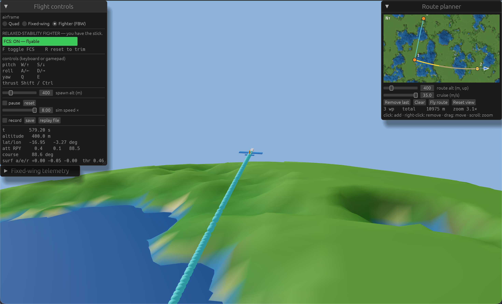
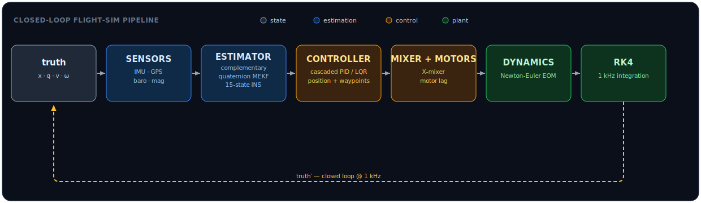

# Pilotrs

[](https://github.com/Aatricks/Pilotrs/actions/workflows/ci.yml)
[](https://www.rust-lang.org)
[](#workspace-layout)
[](LICENSE)

A from-scratch **6-degrees-of-freedom flight simulator and autopilot**, written in Rust. It runs the full rigid-body dynamics of a **quadrotor** and a **fixed-wing** wrapped in a complete **sensing → estimation → control** stack over a spherical, 1/1000-scale Earth.

<p align="center">
  
</p>
<p align="center"><em>Hand-flying the relaxed-stability fighter over the globe — flip the flight-control system off (<code>F</code>) and the unstable airframe departs in under a second (about 0.34s which is comparable to an f16's 0.3s divergency rate).</em></p>

The defining constraint: **the autopilot never sees ground truth.** It flies on noisy, degraded sensor measurements fused by an onboard estimator.

Built on [`nalgebra`](https://nalgebra.org), kept **`no_std`-clean** in the flight-control core (so it can target embedded / Ferrocene toolchains), and visualized with [`three-d`](https://github.com/asny/three-d) + [`egui`](https://github.com/emilk/egui).

<p align="center">
  
</p>

The controller and estimator consume **only** the estimator's output, never truth.

## Features

**Dynamics & integration**
- 6DOF rigid-body equations of motion with the full non-diagonal inertia tensor, shared verbatim by both airframes.
- Fixed-step **RK4** integrator at 1 kHz with per-step quaternion renormalization.
- A quadrotor plant (thrust + drag) and a Beard & McLain **fixed-wing aerodynamic model** (lift/drag/moment coefficients, stall blend, control surfaces, propeller) with a Newton **trim** solver.

**Sensing & estimation**
- Sensor models — IMU, GPS, barometer, magnetometer are each degrading truth with seeded, reproducible noise and bias random-walk.
- Three selectable estimators: a **complementary filter**, a 6-state **quaternion MEKF** (attitude + gyro bias), and a 15-state **INS** (GPS/baro/velocity/mag fusion) that treats the accelerometer as a strapdown input, so sustained acceleration doesn't corrupt attitude.

**Control & guidance**
- A cascaded **PID** and an **LQR** inner loop, swappable per run behind a common `Controller` trait.
- Position/velocity control and **waypoint missions** for the quadrotor.
- A successive-loop **fixed-wing autopilot** holding airspeed, altitude, and course, with coordinated turns.

**Fly-by-wire fighter**
- Through **keyboard or gamepad**, you can hand-fly a **relaxed-stability fighter**: an airframe with a *negative static margin* that is unstable open-loop and pitches away from trim in a fraction of a second.
- An onboard **fly-by-wire** flight-control system with angle-of-attack and rate feedback, pilot command augmentation, dynamic-pressure gain scheduling, helps turning that divergent airframe into a controlled one. **One key toggles it off**, so you can feel the airframe depart the instant the computer stops flying it. That contrast *is* the demo: a modern fighter is its control laws.
- The instability is proven, not asserted: the short-period eigenvalues are linearized about trim and sit in the **right-half plane open-loop**, the **left-half plane closed-loop**.

**Spherical world**
- The planet is a **1/1000-scale Earth** (6371 m radius). The fixed-wing flies in a planet-centered inertial frame with **radial, inverse-square gravity** and **great-circle** routes. The quadrotor flies in a flat local-tangent frame near home, where the curvature is negligible.

**Tooling**
- The deterministic simulation runs on its own thread, decoupled from rendering.
- Bit-exact telemetry **record/replay** and a **parallel Monte-Carlo** harness that runs faster than real time.
- An interactive **3D viewer**: switch airframes, watch the aircraft fly over a displaced globe with a follow-camera, plan routes on a zoomable **planisphere** world map, and read live estimate-vs-truth telemetry.


## Conventions

Defined once in `fsim-core`:

- **World frame:** North-East-Down, gravity is +z, altitude is −z.
- **Body frame:** Forward-Right-Down, at the center of gravity.
- **Attitude:** `q_{world←body}`, Hamilton convention, renormalized every step.
- **Angular rate** is expressed in the body frame (what the gyro measures).

The fixed-wing's "world" is instead a planet-centered inertial frame; its local North-East-Down is a tangent frame derived from the current position. The equations of motion are frame-agnostic, so only gravity (now radial) and the navigation math (great circles) differ.

## Building and running

```bash
cargo test --workspace                                     # run the test suite
cargo run -p fsim-viz  --release                           # the interactive 3D viewer
cargo run -p fsim-sim  --example headless                  # quad flies a waypoint mission, headless
cargo run -p fsim-sim  --release --example montecarlo      # parallel Monte-Carlo
cargo run -p fsim-sim  --release --example pid_vs_lqr       # PID vs LQR step-response comparison
cargo run -p fsim-sim  --release --example fixedwing_cruise # the fixed-wing climbs, turns, changes speed
cargo run -p fsim-sim  --example record_replay             # record a run, reload it, replay it
```

In the viewer, the **airframe** selector flies the quad, the autopilot fixed-wing, or the **Fighter (FBW)**. The other panels switch the estimator (complementary / MEKF / INS) and inner controller (PID / LQR), set the attitude or cruise target, and plot estimate vs. truth vs. setpoint; the **Route planner** is a zoomable world map — click to drop waypoints, then dispatch them to the active aircraft.

Pick **Fighter (FBW)** and you fly by hand:

| | pitch | roll | yaw | throttle | toggle FCS | reset to trim |
|---|---|---|---|---|---|---|
| **keyboard** | `W` / `S` | `A` / `D` | `Q` / `E` | `Shift` / `Ctrl` | `F` | `R` |
| **gamepad** | left stick | left stick | right stick | right stick | `A` | `Start` |

> [!TIP]
> Fly the fighter with the FCS on, then press `F` to disable it and see the behavior.

> [!NOTE]
> The MEKF is an AHRS: it assumes the accelerometer sees gravity, so a sustained translating maneuver degrades its attitude estimate. The INS removes this limitation you may try doing a large tilt under the MEKF, then switch to the INS.

## Toolchain & Ferrocene

Develop on stable Rust. The code is kept compatible with [Ferrocene](https://ferrous-systems.com/ferrocene/) (the qualified Rust toolchain) by construction : MSRV 1.91 and a `no_std`-clean core. A dormant `criticalup.toml` is in place so the Ferrocene compiler can be swapped in without refactoring once a subscription token is configured:

```bash
criticalup auth set && criticalup install && criticalup run cargo build
```

## License

Licensed under the [Apache License, Version 2.0](LICENSE).
